# simple.NSTDA.gama

# GAMA models for BiodiVRestorer VU#1 - User Documentation

---

## Overview

### About BiodiVRestorer VU#1

The BiodiVRestorer Virtual Universe version 1 (VU#1) employs three integrated GAMA simulation models. 
This suite includes:
- **Forest trail model**, designed as an interactive gameplay simulation for seed collection
- **Forest growth model** that projects the forest's ecological development over the subsequent 20 years based on the collected seeds
- **Radar Chart model**, used to visually summarize and analyze the key results derived from the seed collection simulation.

### Learning Objectives
- Raising awareness about biodiversity loss, fostering an understanding of its causes and impacts
- Providing immersive VR experiences on best practices for forest restoration, specifically targeting youth as the future generation.

### Target Audience
- Age group: 15-18 Years old
- Educational level: Secondary School
- Language(s) available: English

---

## System Requirements

### Server

- GAMA Platform [2024.7.0-SNAPSHOT]
   - With the SIMPLE plugin installed
- SIMPLE Webplatform

### VR Headsets
- Meta Quest 3
- Biodivrsity1.1.apk

---

## Installation Guide

### Unity VR Application Installation

1. Download BiodiVRestorer.apk from [download location]
2. Run the installer
3. Follow on-screen instructions
4. Launch from desktop shortcut or Start menu

### Web Platform Access
1. Open your web browser
2. Navigate to [Web Platform URL]
3. Create an account or login with provided credentials
4. Select [Application Name] from the dashboard

---

## Getting Started

### Initial Setup
[List here how to install the application, is there any specific settings to add in the `.env`, is there a `settings.json` to create, else]


### Starting the Virtual Universe (VU)

เพิ่ม npm strat เปิดแอพของ web platform แล้วก็ต่อด้วยรูป 1
เพิ่ม flow การเล่นเกม 1 (canva) ก่อนการเล่นเกม

#### 1. Open the web platform

```bash
 cd /path/to/simple.webplatform/
 npm start
```

#### 2. select “1. Forest Trails”

   Open the web platform and select 1. Forest Trails as shown in the following figure.   

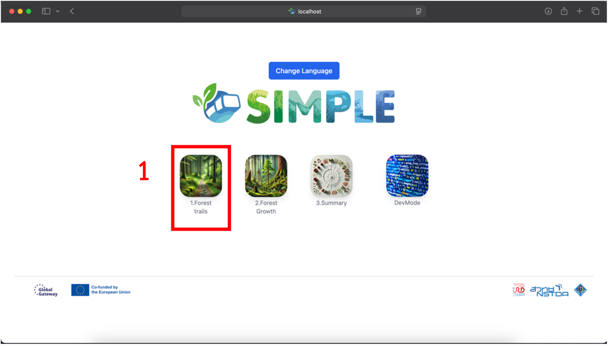

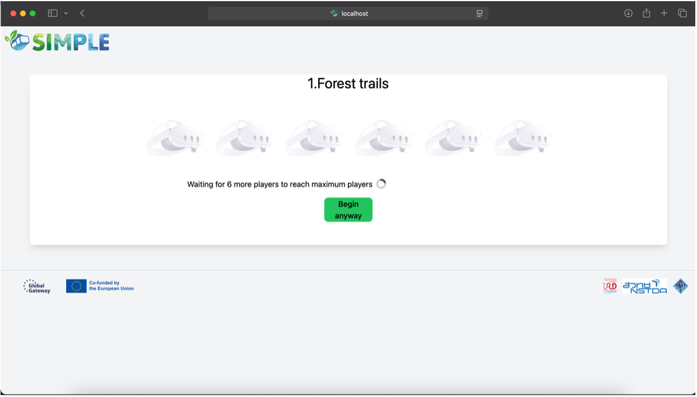

#### 2. Launch the VR application

   The player checks that the Wi-Fi network is the same as the computer, then selects the **“BiodiVRestorer”** application on the VR headset.

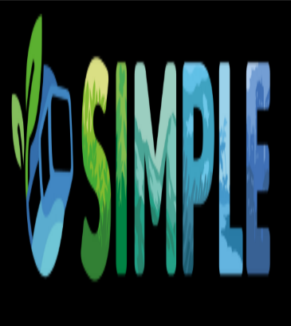

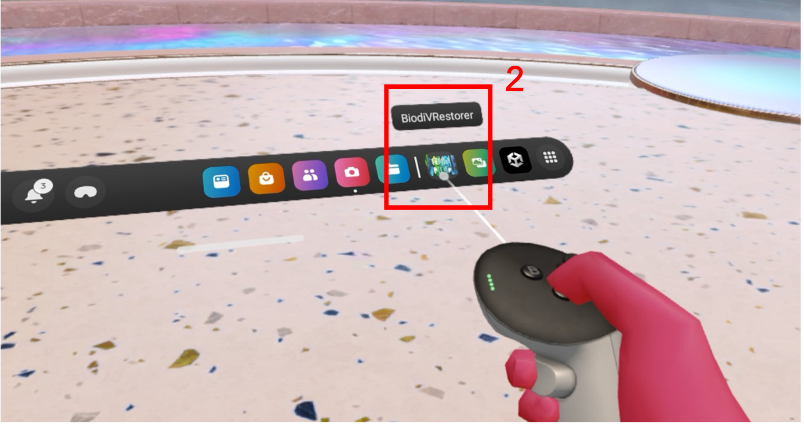

#### 3.  Check VR connections from the web platform

Click the VR headset icon on the web platform to check the connection status of each player.

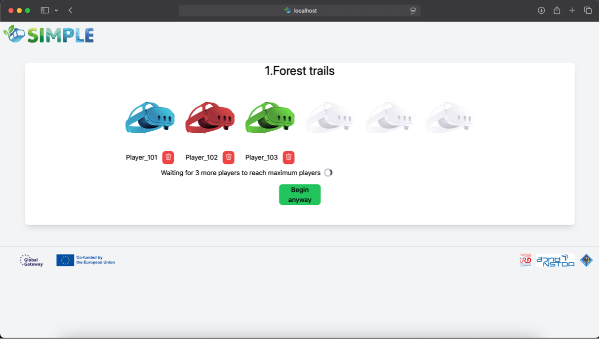

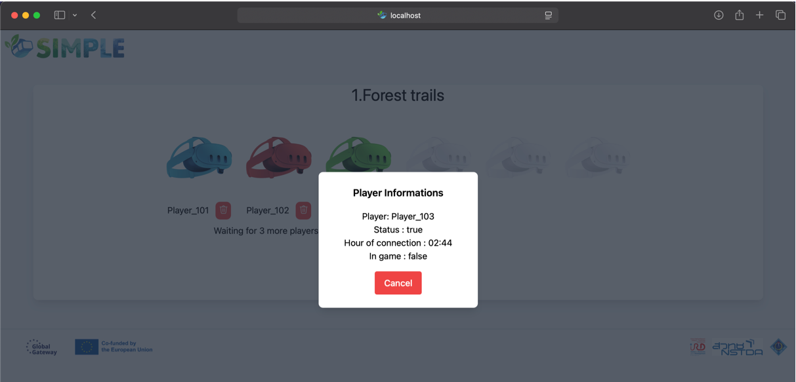


#### 4. Wait for GAMA to launch and start the model

The webplatform will automatically launch the model on GAMA. 
Once you have confirmed that all players are connected, 
you can click the **“begin anyway”** button to start the simulation.

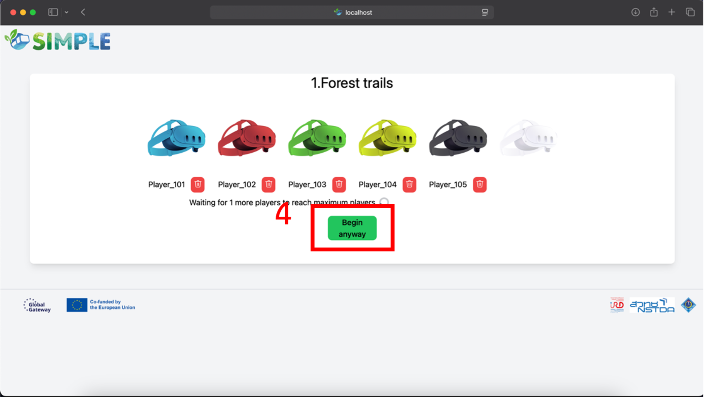

make sure open gama
url local host

#### 5. Start the tutorial

Check that all players are ready, then click the **“Play”** button on the web platform to start the tutorial.

If any player encounters a problem, such as a lost connection,
press that player’s **“Reset”** button in GAMA.

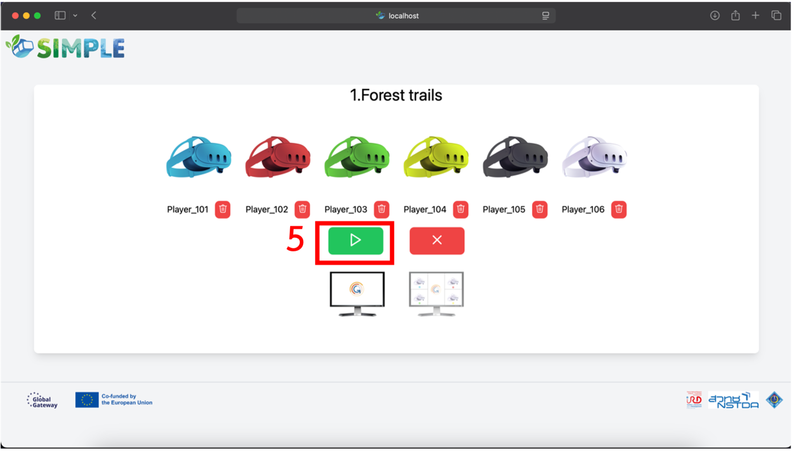
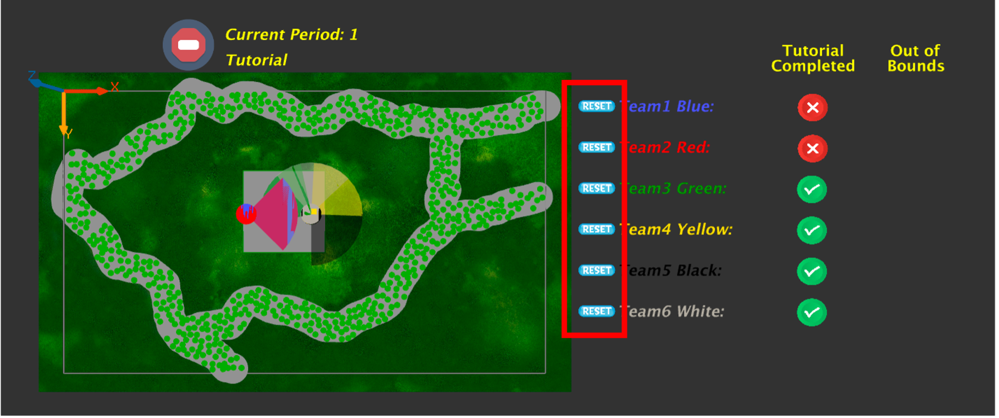


#### 6. Start the main simulation (3-minute rounds)

After all players have completed the tutorial, check that everyone is ready. 

Then click **“Play”** on the web platform to send the players into the assigned zone. 
Each round is limited to 3 minutes of playtime. 

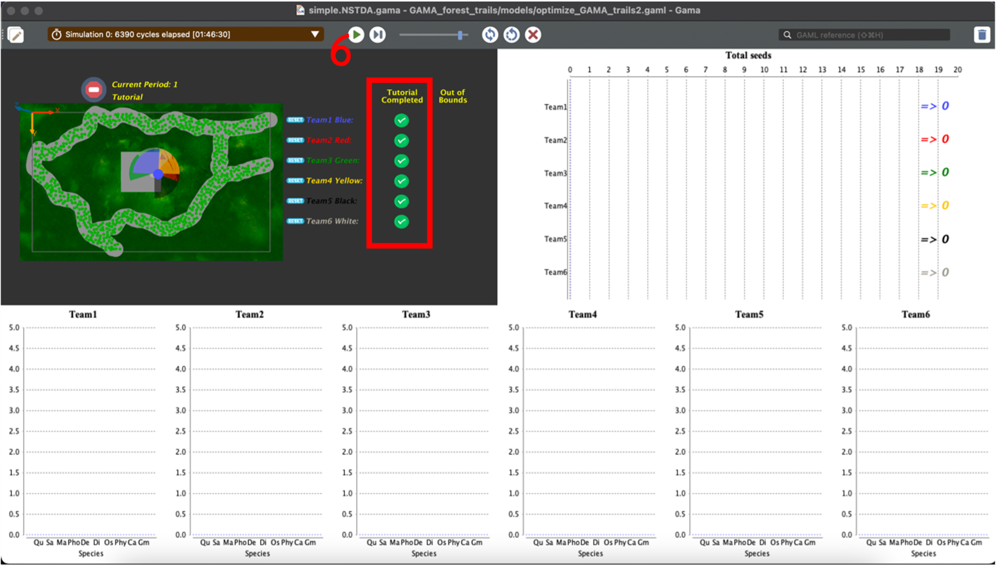

อธิบาย ว่าในเกมทำอะไร อาจจะเพิ่มรูประหว่างเล่น

#### 7. Switch players between rounds

After 3 minutes, the system will display a notification on the VR headset to inform the player that the time is up. 
Then, change the VR glasses to the next player to start a new round.
 
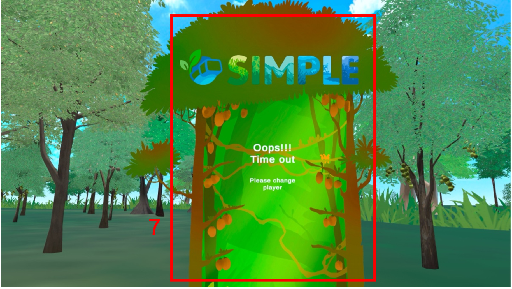


#### 8. Repeat for 6 rounds

Repeat steps 5–7 for a total of 6 rounds so that all players have the opportunity to fully participate.   

(Depend on num of student and reapeated)

#### 9. End the simulation and return to the home page

When the simulation has completed 6 rounds and you want to return to the web platform’s home page, 
click the red cross button on the web platform to stop the simulation in GAMA and prepare for the next session.

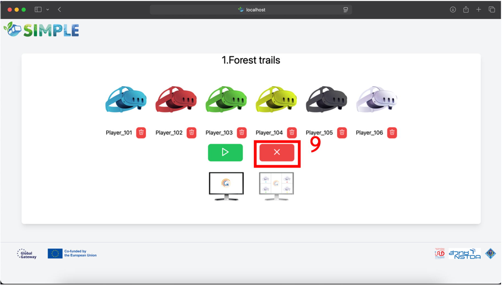

---

### Basic Controls

#### For GAMA Models 
Users interact with the GAMA interface mainly by **left-clicking** on the available control buttons:

- **Play / Pause experiment** (keyboard shortcut: `Command + P` or `Control + P`)
- **Close experiment** (keyboard shortcut: `Shift + Command + X` or `Shift + Control + X`)
- **Reset** button — used when a player loses connection 


#### For Unity VR Games 

- **Movement**: 
   - Use the **left thumbstick** to move forward and backward.
- **Interaction**: 
   - Use the **right trigger button** (index finger) to fire the crossbow.
   - Use the **right grip button** (middle finger) to pick up or grab objects.
- **Menu Access**: 
   - Press the **Meta / Oculus button** on the right controller to open the main menu and exit the game.

#### For Web Platform 
- **Play / Pause Button** 


- **Close Button**


- **VR headset Status Checking**


---

## Using the Virtual Universe

### Main Features

#### Exploration Mode
<!--
ผู้เล่นสามารถเดินในโซนป่าไม้ที่กำหนดในแต่ละรอบ โดยการใช้นิ้วโป้งด้านซ้ายมือในการเดิน นอกจากนี้ผู้ใช้ยังสามารถหันซ้าย-ขวาได้ โดยการขยับศีรษะและลำตัวไปในด้านนั้น ๆ เพื่อสำรวจป่าไม้ โดยในแต่ละรอบผู้เล่นแต่ละคน จะได้เห็นต้นไม้ และผลไม้ที่แตกต่างกัน หรือเหมือนกันในบางชนิดซึ่งขึ้นอยู่กับ ฤดูกาลของต้นไม้ในแต่ละสปีชีส์ของต้นไม้นั้นๆ
-->

#### Learning Modules 

1. **Module 1: [Seed Collection]**
   - Duration: 
      - tutorial: It depends on the player
      - In game: 18 minutes

   - Objectives: 
      - Learn how to work as a team and plan seed collection for each round.
      - Learn to make decisions under time constraints.
      - Develop awareness of how collecting alien species can negatively affect the forest.
      - Gain basic knowledge about forest restoration through seed collection.

   - Activities: 

      Players plan their seed collection strategy for each round. 
      In every round, each player takes a turn exploring the forest and collecting seeds from trees of different species, 
      all within a limited amount of time.

2. **Module 2: [Forest Growth]**
   - Duration: approximately 10-15 minutes

   - Objectives:
      -	Raise awareness of how collecting alien species can affect long-term forest restoration through a 20-year forest growth simulation.
	   -	Learn about forest growth through visualization, which shows healthy trees, alien species, and dead trees.
	   -	Learn about RSA as an indicator for assessing the level of forest degradation.

   - Activities: 

     Once the number of seeds collected from Forest Trails has been recorded, 

     the forest growth simulation is run. This simulation shows tree growth within a 1-hectare area over a 20-year period. 
     Each team can then see the outcome of their forest restoration efforts, including the RSA value after 20 years of simulation.
     Then the results will be discussed among each team. For example, if alien species are collected, how will they affect forest restoration?
    
---

#### Interactive Elements

#### Unity VR Games

-**Environmental Indicators**: 

   When the player collects fruit into the basket, a sound effect will play when the fruit is successfully dropped into the basket.

-**Interactive Objects**:

<!--
อะรไที่เด็ก interact ได้ หน้าไม้ ไม้สอย
- อุปกรณ์
- การหยิบผลไม้
- การยิงแล้วผลไม้ตกลงมา
- การเก็บผลไม้ลงตะกร้่า
-->
   **Equipment**

   On the player’s left arm, there are two equipment boxes:

   1. **Crossbow**

      - The player can raise their left arm and look at it.  
      When the equipment box with the crossbow appears, use the right hand to point at the box until it is highlighted in green.
      Then, use the **right grip button (right middle finger)** to grab the equipment.

      - **How to use:**
      After the player has equipped the crossbow, point at the fruit box on the tree.  
      Press the **right trigger button (right index finger)** to shoot.  
      When the message **“pull back”** appears, pull your hand back to make the fruit fall.

   2. **Fruit picker**

      - Picking up the fruit picker is done in the same way as the crossbow.

      - **How to use:**
      After the player has picked up the fruit picker, hook it onto the fruit to make the fruit fall down.

   **Picking up fruit and placing it in the basket**

   Once the fruit has fallen to the ground, use the **left thumbstick (left thumb)** to move toward the fruit.  
   Then, use the **right grip button (right middle finger)** to pick up the fruit.  

   A basket is located at the player’s left hip.  
   Place the fruit into the basket by releasing the right middle finger.  
   A sound effect will play when the fruit is successfully placed in the basket.

#### GAMA

   - **Agents**: 
      - **Map**

      The map represents the overall forest environment in the game, including the trails that players explore. 
      These forest trails are divided into six zones, as shown in the image below.

      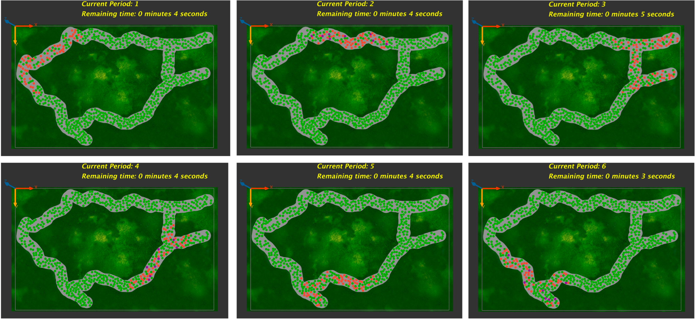

      - **Tree** 

      Tree agents are displayed along the forest trails. Each tree stores information such as its position, species, 
      whether it is fruit-bearing or not, and whether it is an alien or native species.
         
      - **Player**

      Player agents represent the individual VR headset users in each team.


   - **Data Visualization**: 
      - **Graphs**

         Forest trail model

         - Graph shows the total number of seeds in each team
            A graph showing the total number of seeds collected by players on each team
            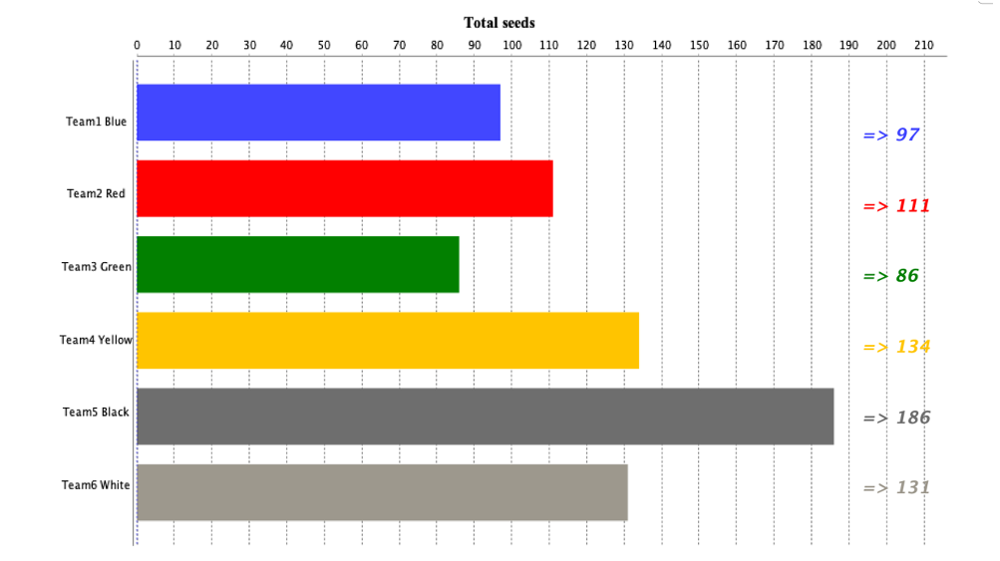

         - Graph of seed counts by species
            A graph shows the number of seeds of each species collected by players on each team 
            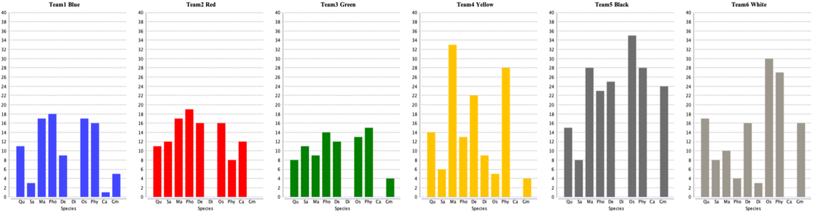

      - **Map**
         - **Trails Map**:  It represents the forest trails for the players to walk along, with

            - *Tutorial Zone*

               It is the area used to practice the various skills that players will need in the game, 
               such as walking, picking up equipment, and placing fruit into the basket,
               in order to prepare them before entering the forest to collect seeds. 
               In the figure, this corresponds to the grey rectangular area in the center of the trails map.

               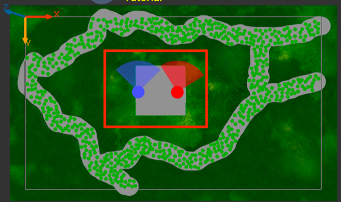

            - *Trails Zone*
               
               It is the forest trail used for collecting seeds for forest restoration. 
               In the figure, this corresponds to the long grey path, which is divided into six zones as previously described.

               Within the trails zone, tree agents are displayed as circles in three colors, where:
                  - **Green**  represents native species without fruit.
                  - **Orange** represents native species with fruit.
                  - **Purple** represents alien species with fruit.

               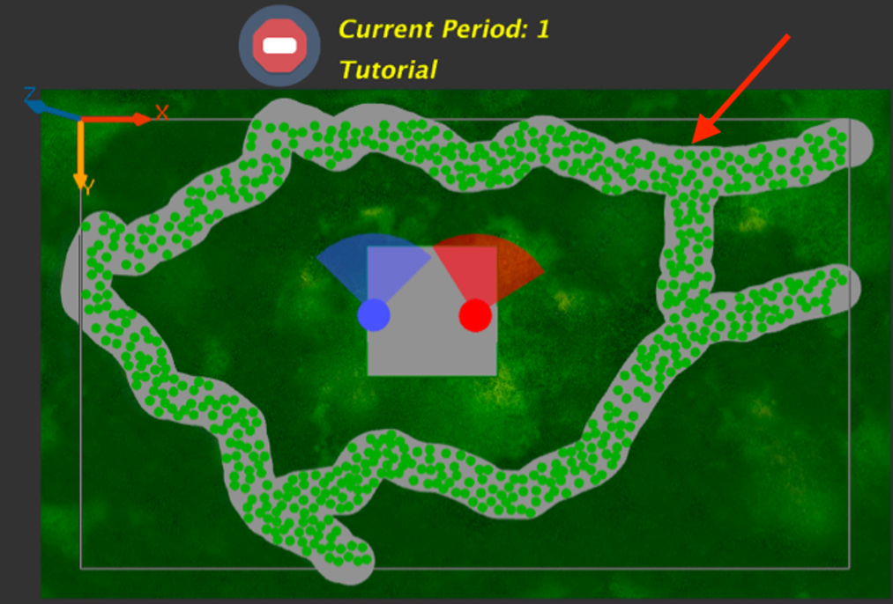

         - *Players* 

            It represents the players who are currently wearing the VR headsets. 
            Each player is shown as a colored circle, such as red, blue, green, yellow, black, or white.

            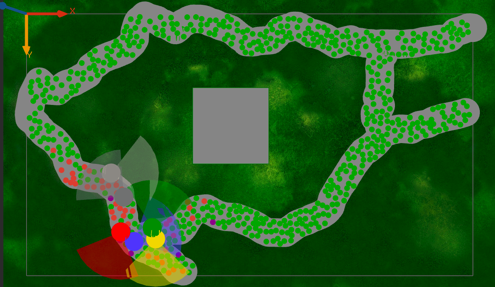

         - *Remaining Time*

            It is a countdown timer (3 minutes) that indicates how much time is left in each round.

            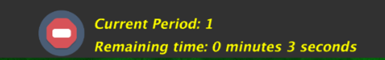

         - *Icon play/pause*

            It is an icon used to indicate whether the game is currently playing or paused.

            
            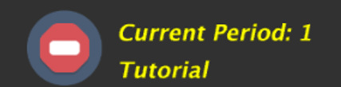

         - *Reset Button*

            It is a button used when a player encounters an error,
            such as a lost connection that prevents their current data from being updated.
            Pressing this button will resend the current game state and the player’s position.

            

         - *Out of bounds*

            It is an icon used to indicate whether a player has walked outside the designated zone.

            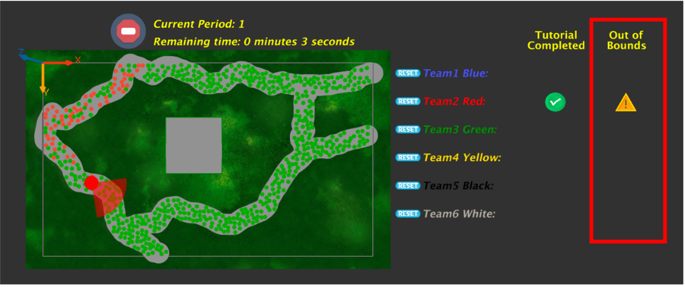

         - *Tutorial Completed*

            It is an icon that appears when a player has completed the tutorial, helping to check whether everyone is ready to start the game.

            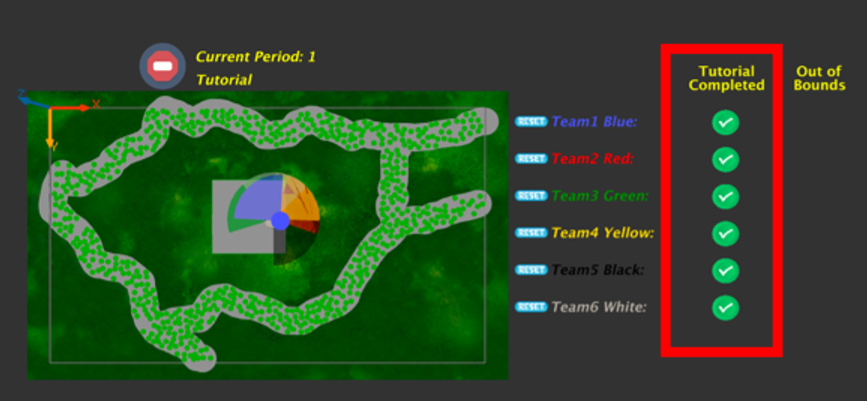

      - **Forest growth simulation**

         This module uses the seed collection results from each team’s forest trail to simulate forest growth over a 20-year period.
         In the visualization, tree states are represented by colors as follows:
            
         - **Red** represents alien species,
         - **Black** represents dead trees,
         - Other colors represent different tree species.

         The simulation also displays the RSA value. The team whose RSA is closest to 3100 is considered to have the most thriving forest.
         In addition, the survival of trees for each team is shown as:
         number of **surviving trees / total number of trees planted**

         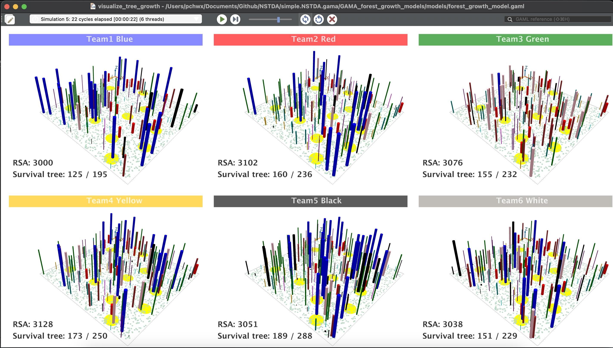


      - **Charts**

         **Radar Chart model**

         The radar chart summarizes the seed collection performance of each team and indicates whether it meets the specified criteria.
         It consists of ten axes representing the ten seed species (e.g., Qu, Sa, Ma, Pho, De, etc.). The performance is divided into three levels:
         - Level 1: **Below** the specified criteria (inner ring)
         - Level 2: **Meets** the criteria (middle ring)
         - Level 3: **Exceeds** the criteria (outer ring)

         

         In addition, the radar chart also shows the number of species that are as planned, not as planned, and the number of species that contain alien species.

         


- **Scenario Controls**: [How to modify parameters]


---

### Simulation Controls (GAMA Specific)

#### Running Simulations (GAMA)

1. Select scenario from webplatform
   

2. Click **"Run"** to start simulation
3. Monitor indicators in real-time

วิธีการรัน simulation gama
<!--
#### Parameter Adjustment 

เลือก scenario ที่ต้องการ เช่น *เส้นทางป่า* บนแพลตฟอร์มเว็บเมื่อผู้เล่นทั้งหมดเชื่อมต่อกัน แพลตฟอร์มเว็บจะเปิดแบบจำลอง GAMA ที่เกี่ยวข้องโดยอัตโนมัติ

- **Forest trails**
   - `stop_time`
      - default: 180 (3 minutes)
      - affects: The duration that players need to explore the forest and collect seeds.

- **Forest Growth**
   - `map_size`
      - default: 100x100 square meters (1 hectare)
      - affects: The size of the area used in the forest restoration simulation.
   - `n_simulation`
      - default: 20 years
      - affects: Number of years to simulate forest growth.
   - `init_height`
      - default: 50 cm
      - affects: The initial height of the trees used for calculation in the logistic growth equation.
   - `init_RCD`
      - default: 2 cm
      - affects: The initial root collar diameter of the trees used for calculation in the logistic growth equation.
   - `num_of_oldtree`
      - default: 2859 trees
      - affects: The number of existing trees before forest restoration.

      ภาพการเล่น 6 season วนเล่นตามเวลาที่เปลี่ยน
--->

### Game Progression (Unity VR Specific)

#### Levels/Stages


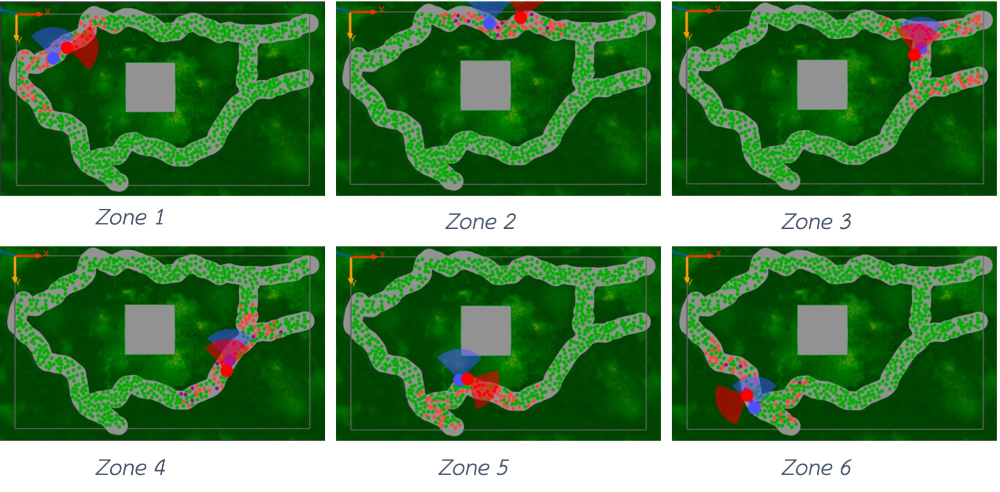

#### Progress tracking 

-  Graph showing the number of seeds collected for each species and the total number of seeds.

---

## Educational Features

### Learning Assessment

- In-activity checkpoints
   กราฟคะแนน
   total seed
   by species

- Post-activity evaluation
   forest growth
   radar chart [ref from figure]

- Progress reports for educators
   forest growth (อธิบายเพิ่มเติม)

### Collaborative Features
<!--
- Multiplayer mode (if applicable)
- Shared scenarios
- Discussion forums
-->

- Group challenges
   competetion กราฟคะแนน
   collaboration 


### Educational Resources
- In-app glossary
- Fact sheets (ใบงาน pheno, seed collection plan)
- External links to resources 
- Teacher's guide availability

---

## Troubleshooting

### Common Issues and Solutions

#### VR-Specific Issues
**Problem**: One headset turned-off during a game
**Solution**:
- Turn it back on
- Reopen the game
- Auto-magically reconnecting

---

## Frequently Asked Questions

### General Questions

**Q: Can I use this offline?**

A: There is no offline version yet.

**Q: How do I save my progress?**

A: Unable to save progress

**Q: Is this available in my language?**

A: Only in English

### Technical Questions

**Q: What VR headsets are supported?**
A: meta quest 3 only

**Q: Can I run this on a tablet/mobile device?**
A: No 

### Educational Questions

**Q: How long does each session take?**
A: [Typical session duration]

**Q: Can teachers monitor student progress?**
A: [Explain teacher dashboard/tools if available]

### Bug Reporting

Please report bugs through:
1. GitHub issues page: [your repo]
2. [Else ?]

---

## Appendices

[If you have more ideas of stuff to write down, otherwise please remove it :) ]
-->
