# simple.NSTDA.gama

# GAMA models for BiodiVRestorer VU#1 - User Documentation

---

## Overview

### About BiodiVRestorer VU#1

The BiodiVRestorer Virtual Universe version 1 (VU#1) employs three integrated GAMA simulation models. 
This suite includes:
- **Forest trail model**, designed as an interactive gameplay simulation for seed collection
- **Forest growth model**, that projects the forest's ecological development over the subsequent 20 years based on the collected seeds
- **Radar Chart model**, used to visually summarize and analyze the key results derived from the seed collection simulation.

### Learning Objectives
- Raising awareness about biodiversity loss, fostering an understanding of its causes and impacts
- Providing immersive VR experiences on best practices for forest restoration, specifically targeting youth as the future generation.

### Target Audience
- Age group: 15-18 Years old
- Educational level: Secondary School
- Language(s) available: English

---

## System Requirements

### Server

- GAMA Platform [2024.7.0-SNAPSHOT]
   - With the SIMPLE plugin installed
- SIMPLE Webplatform

### VR Headsets
- Meta Quest 3
- Biodivrsity1.1.apk

---

## Installation Guide

### Unity VR Application Installation

1. Download BiodiVRestorer.apk from [download location]
2. Run the installer
3. Follow on-screen instructions
4. Launch from desktop shortcut or Start menu

### Web Platform Access
1. Open your web browser
2. Navigate to [Web Platform URL](https://github.com/project-SIMPLE/simple.webplatform/releases/tag/v2.0)

<!--
3. Create an account or login with provided credentials
4. Select [Application Name] from the dashboard
-->

---
## Simulation Workflow

### Forest trail model
<a href="PICTURES/Forest_Trails_WF.png">
      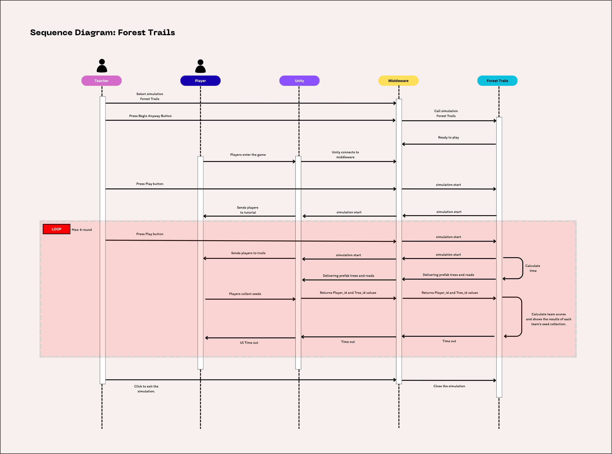
</a>

### Forest growth model

<a href="PICTURES/Forest_growth_WF.png">
      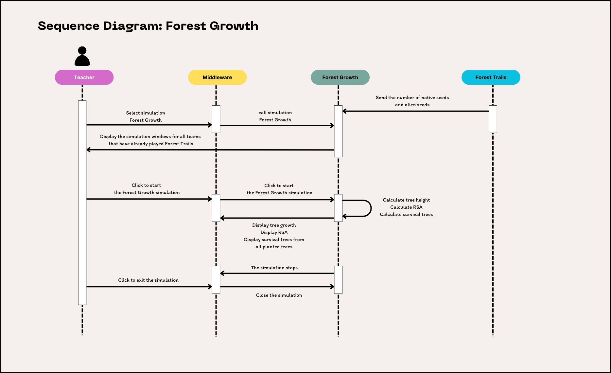
</a>


---

## Getting Started

<!--
### Initial Setup

[List here how to install the application, is there any specific settings to add in the `.env`, is there a `settings.json` to create, else]
-->

### Starting the Virtual Universe (VU)

#### 1. Open the web platform

   Open a terminal and run the command below to generate a URL for the web platform.
   Then copy that URL and open it in your web browser.

```bash
 cd /path/to/simple.webplatform/
 npm start
```

#### 2. Select a scenario

   Open the webplatform and select **1. Forest Trails** as shown in the following figure.   

   <a href="PICTURES/scenario.PNG">
         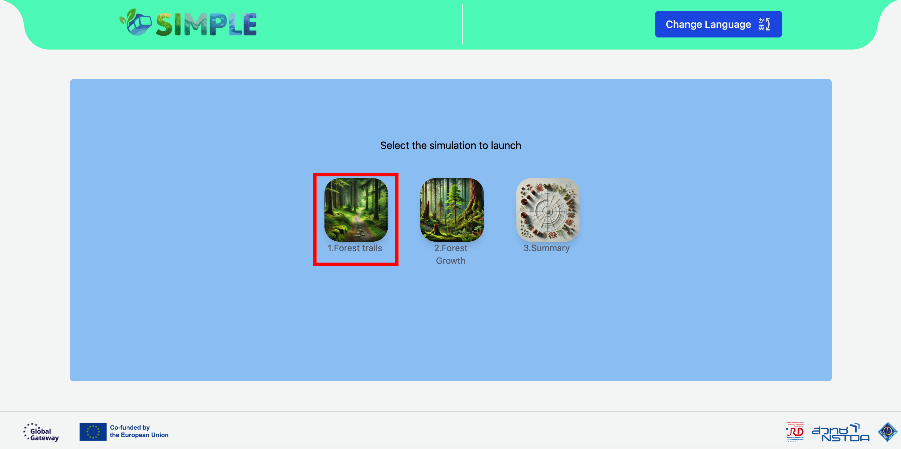
   </a>
  
#### 3. Launch the VR application

   After the player puts on the VR headset, make sure it is connected to the same Wi-Fi network as the computer.
   Then, select the **“BiodiVRestorer”**  application on the headset.

   <a href="PICTURES/select_app.png">
         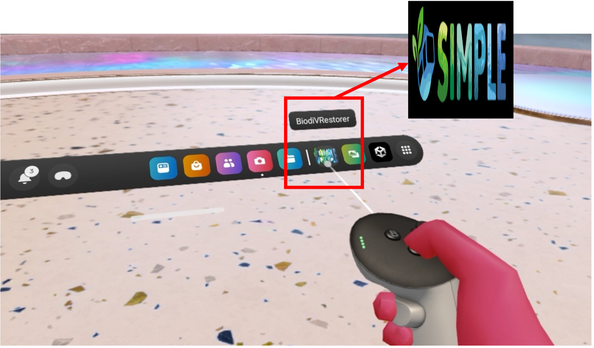
   </a>

#### 4.  Check VR connections from the webplatform

   Click the VR headset icon on the webplatform to check the connection status of each player.

   <a name= "fig-check-connect" href="PICTURES/check_connect.png">
         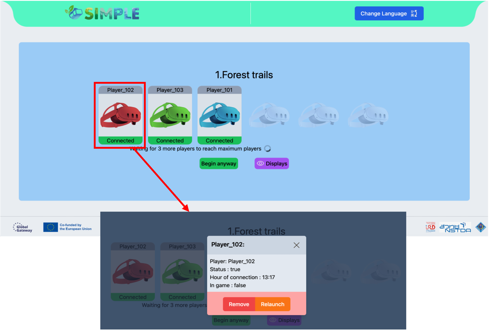
   </a>


#### 5. Wait for GAMA to launch and start the model

Once you have confirmed that all players are connected, 
you can click the **“begin anyway”** button to call the **Forest Trails** Simulation.

   <a href="PICTURES/beginanyway.PNG">
         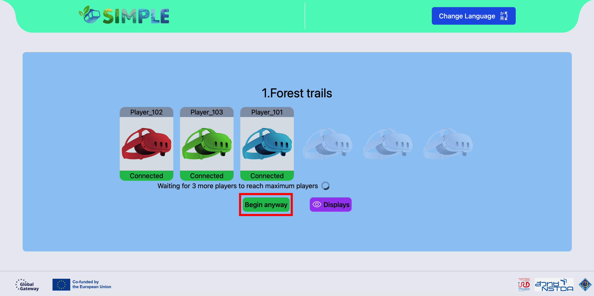
   </a>

#### 6. Start the tutorial

Check that all players are ready, then click the **“Play”** button on the web platform to start the tutorial.\
In the tutorial, players will practice three basic skills needed in the game:
1.	Walking
2.	Using the fruit picker
3.	Using the crossbow to shoot fruit down from the trees

   <a href="PICTURES/play.PNG">
      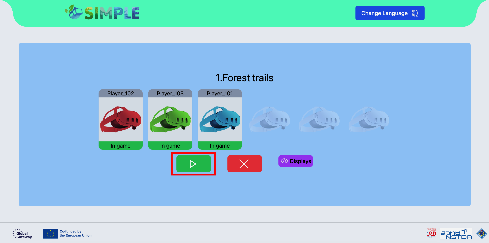
   </a>

#### 7. Start the main simulation (3-minute rounds)

After all players have completed the tutorial, check that everyone is ready. \
Then click **“Play”** on the webplatform again (as in Step 6) to send the players into the assigned zone.\
Each round is limited to 3 minutes of playtime (max 6 rounds)\

In the main game, players explore the forest to collect seeds.\
In each round, different tree species are available, \
and each species produces fruit according to the schedule shown in Table X.... \
Players must plan their seed collection strategy for each round based on these species and their fruiting times.


#### 8. Switch players between rounds

After 3 minutes, the system will display a notification on the VR headset to inform the player that the time is up. \
Then, change the VR glasses to the next player to start a new round.
 

   <a href="PICTURES/ui_timeout.png">
      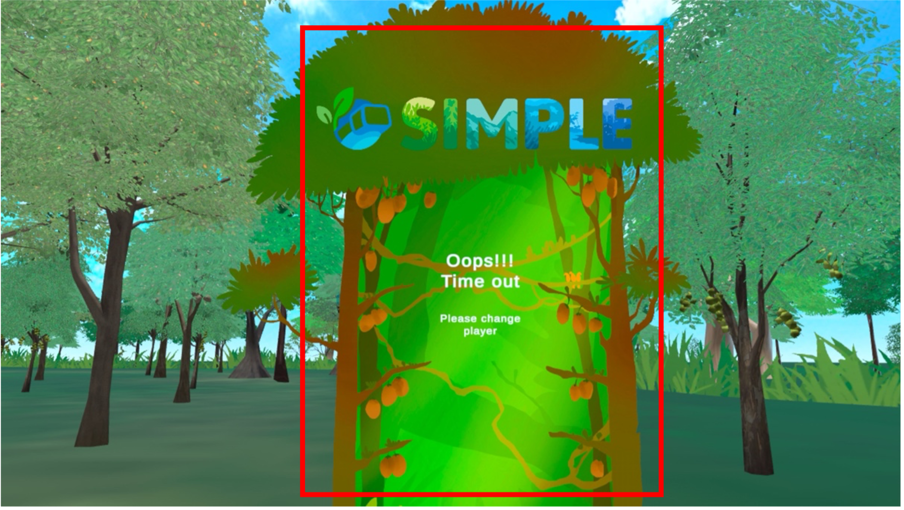
   </a>

#### 9. Repeating Rounds for All Players

Repeat steps 6 – 8 as needed, depending on the number of students (Max 6 player)\
and how many times you want them to play,\
so that all players have the opportunity to fully participate.


#### 10. End the simulation and return to the home page

When the simulation has completed and you want to return to the web platform’s home page,\
click the red cross button on the web platform to stop the simulation in GAMA and prepare for the next session.

   <a href="PICTURES/end_sim.PNG">
      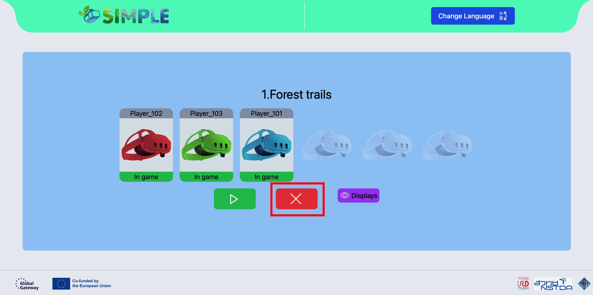
   </a>


> [!NOTE]\
> If any player encounters a problem, such as a lost connection, have them exit the game on the VR headset and reopen it.\
> After that, press the **Reset** button for that player in GAMA.

---

### Basic Controls

#### For GAMA Models 
Users interact with the GAMA interface mainly by **left-clicking** on the available control buttons:

1. **Play / Pause experiment** (keyboard shortcut: `Command + P` or `Control + P`)
2. **Close experiment** (keyboard shortcut: `Shift + Command + X` or `Shift + Control + X`)
3. **Reset** button — used when a player loses connection 

   <a href="PICTURES/GAMA_control.PNG">
      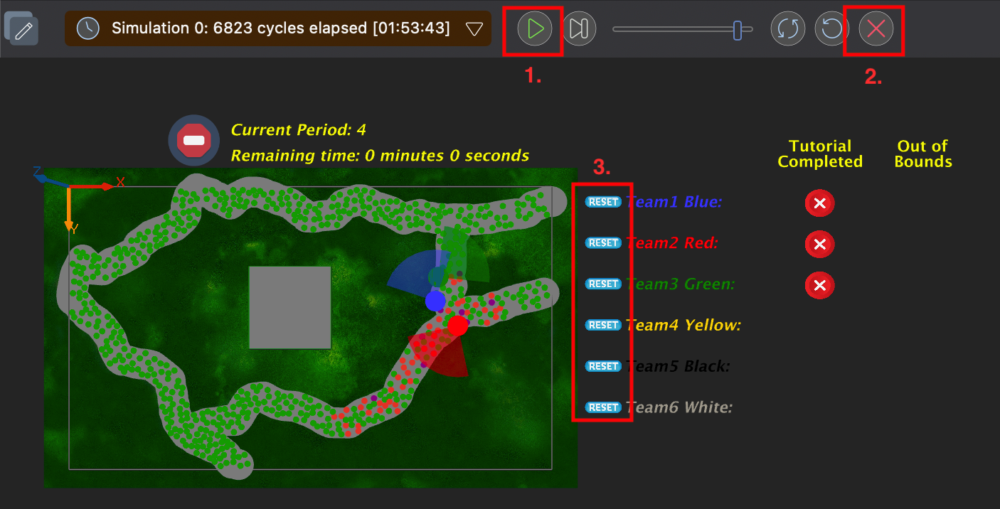
   </a>

#### For Unity VR Games 

- **Movement**: 
   - Use the **left thumbstick** to move forward and backward.
- **Interaction**: 
   - Use the **right trigger button** (index finger) to fire the crossbow.
   - Use the **right grip button** (middle finger) to pick up or grab objects.
- **Menu Access**: 
   - Press the **Meta / Oculus button** on the right controller to open the main menu and exit the game.

	<a href="PICTURES/VRGameControl.png">
      
	</a>


#### For Web Platform 
1. **Play / Pause Button** 
2. **Close Button**

   <a href="PICTURES/webpf_control.PNG">
      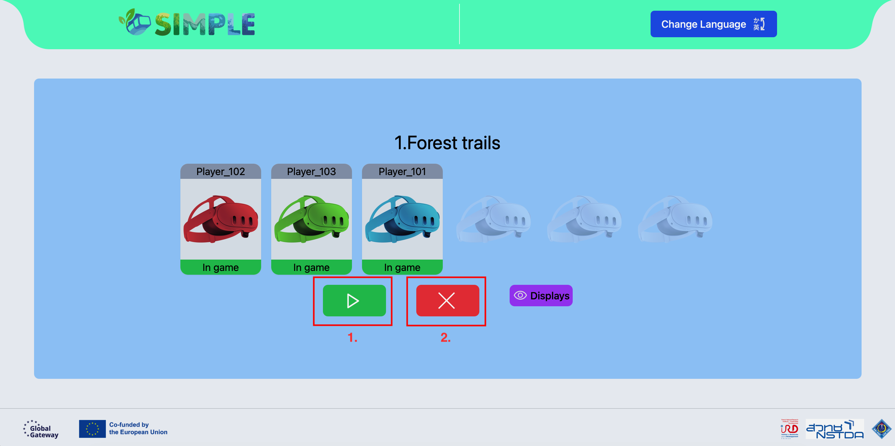
   </a>

3. **VR headset Status Checking**
   
   See [Check VR connections](#fig-check-connect).

---

## Using the Virtual Universe

### Main Features

<!--
#### Exploration Mode
-->

#### Learning Modules 

1. **Module 1: Forest Trails**
   - Duration: 
      - tutorial: It depends on the player
      - In game: 18 minutes

   - Objectives: 
      - Learn how to work as a team and plan seed collection for each round.
      - Learn to make decisions under time constraints.
      - Develop awareness of how collecting alien species can negatively affect the forest.
      - Gain basic knowledge about forest restoration through seed collection.

   - Activities: 

      Players plan their seed collection strategy for each round. \
      In every round, each player takes a turn exploring the forest and collecting seeds from trees of different species, \
      all within a limited amount of time.

2. **Module 2: Forest Growth**
   - Duration: approximately 10-15 minutes

   - Objectives:
      -	Raise awareness of how collecting alien species can affect long-term forest restoration through a 20-year forest growth simulation.
	   -	Learn about forest growth through visualization, which shows healthy trees, alien species, and dead trees.
	   -	Learn about RSA as an indicator for assessing the level of forest degradation.

   - Activities: 

     Once the number of seeds collected from Forest Trails has been recorded, \
     the forest growth simulation is run. This simulation shows tree growth within a 1-hectare area over a 20-year period. \
     Each team can then see the outcome of their forest restoration efforts, including the RSA value after 20 years of simulation.\
     Then the results will be discussed among each team. For example, if alien species are collected, how will they affect forest restoration?

   
---

#### Interactive Elements

#### Unity VR Games

- **Environmental Indicators**: 

   When the player collects fruit into the basket, a sound effect will play when the fruit is successfully dropped into the basket.

- **Interactive Objects**:

   **Equipment**

   On the player’s left arm, there are two equipment boxes:

   1. **Crossbow**

      - The player can raise their left arm and look at it.  
      When the equipment box with the crossbow appears, use the right hand to point at the box until it is highlighted in green.\
      Then, use the **right grip button (right middle finger)** to grab the equipment.

      - **How to use:**
      After the player has equipped the crossbow, point at the fruit box on the tree.  
      Press the **right trigger button (right index finger)** to shoot.  
      When the message **“pull back”** appears, pull your hand back to make the fruit fall.

   2. **Fruit picker**

      - Picking up the fruit picker is done in the same way as the crossbow.

      - **How to use:**
      After the player has picked up the fruit picker, hook it onto the fruit to make the fruit fall down.

   **Picking up fruit and placing it in the basket**

   Once the fruit has fallen to the ground, use the **left thumbstick (left thumb)** to move toward the fruit.  
   Then, use the **right grip button (right middle finger)** to pick up the fruit.  

   A basket is located at the player’s left hip.  
   Place the fruit into the basket by releasing the right middle finger.  
   A sound effect will play when the fruit is successfully placed in the basket.

#### GAMA

   - **Agents**: 

      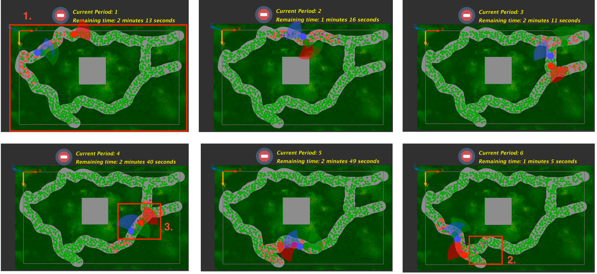

      1. **Map**

      The map represents the overall forest environment in the game, including the trails that players explore. 
      These forest trails are divided into six zones, as shown in the image below.

      2. **Tree** 

      Tree agents are displayed along the forest trails. Each tree stores information such as its position, species, 
      whether it is fruit-bearing or not, and whether it is an alien or native species.

      - Tree agents are displayed as circles in three colors, where:

         - **Green**  represents native species without fruit.
         - **Orange** represents native species with fruit.
         - **Purple** represents alien species with fruit.
         
      3. **Player**

      Player agents represent the individual VR headset users in each team.


   - **Data Visualization**: 
      - **Graphs**

         Forest trail model

         1. Graph shows the total number of seeds in each team
            A graph showing the total number of seeds collected by players on each team

         2. Graph of seed counts by species
            A graph shows the number of seeds of each species collected by players on each team 
        
        

      - **Map**

          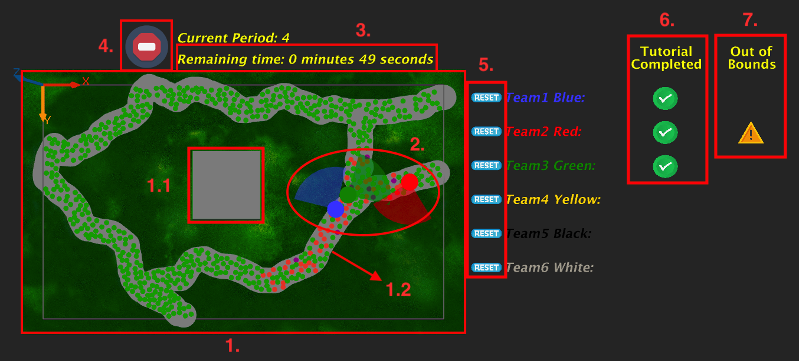

         1. **Trails Map**:  It represents the forest trails for the players to walk along, with

            1.1 *Tutorial Zone*

               It is the area used to practice the various skills that players will need in the game, 
               such as walking, picking up equipment, and placing fruit into the basket,
               in order to prepare them before entering the forest to collect seeds. 
               In the figure, this corresponds to the grey rectangular area in the center of the trails map.

            1.2 *Trails Zone*
               
               It is the forest trail used for collecting seeds for forest restoration. 
               In the figure, this corresponds to the long grey path, which is divided into six zones as previously described.

            <a href="PICTURES/table_pheno.png">
               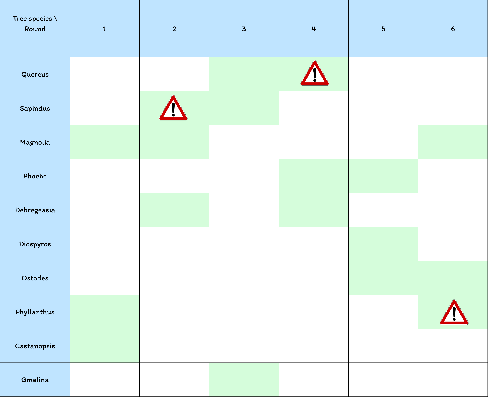
            </a>

         2. **Players** 

            It represents the players who are currently wearing the VR headsets. 
            Each player is shown as a colored circle, such as red, blue, green, yellow, black, or white.

         3. **Remaining Time**

            It is a countdown timer (3 minutes) that indicates how much time is left in each round.

         4. **Icon play/pause**

            It is an icon used to indicate whether the game is currently playing or paused.

         5. **Reset Button**

            It is a button used when a player encounters an error,
            such as a lost connection that prevents their current data from being updated.
            Pressing this button will resend the current game state and the player’s position.

         6. **Tutorial Completed**

            It is an icon that appears when a player has completed the tutorial, 
            helping to check whether everyone is ready to start the game.

         7. **Out of bounds**

            It is an icon used to indicate whether a player has walked outside the designated zone.

      - **Forest growth simulation**

         This module uses the seed collection results from each team’s forest trail to simulate forest growth over a 20-year period.

         In the visualization, tree states are represented by colors as follows:
            
         - **Red** represents alien species,
         - **Black** represents dead trees,
         - Other colors represent different tree species, as shown in the table below.

            | Tree Species     | Color |
            |-----------------|-----------------------------|
            | Quercus         | `#magenta`                  |
            | Sapindus        | `#green`                    |
            | Magnolia        | `#tan`                      |
            | Phoebe          | `#yellow`                   |
            | Debregeasia     | `#pink`                     |
            | Diospyros       | `#gray`                     |
            | Ostodes         | `#coral`                    |
            | Phyllanthus     | `#gold`                     |
            | Castanopsis     | `#blue`                     |
            | Gmelina         | `#olive`                    |
            | Dead tree       | `#black`                    |
            | Alien Species   | `#red`                      | 


         Differences in the height and thickness of each cylinder reflect the growth rate of each species, so trees end up with different sizes depending on their species.

         The simulation also displays the RSA value. The team whose RSA is closest to 2500 is considered to have the most thriving forest.
         In addition, the survival of trees for each team is shown as:
         number of **surviving trees / total number of trees planted**

         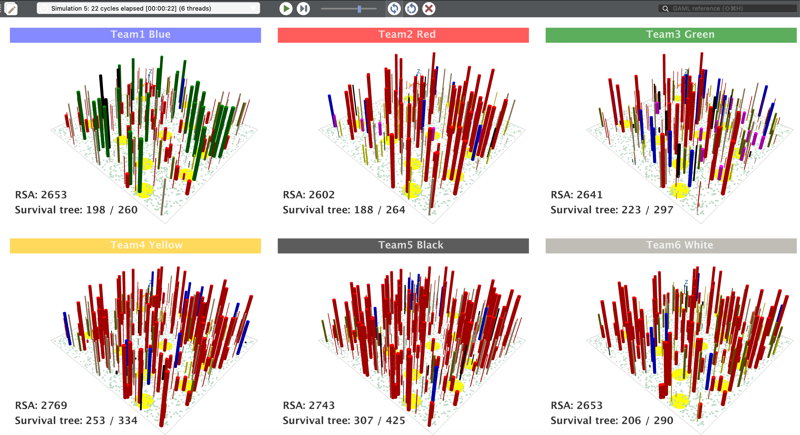

      - **Charts**

         **Radar Chart model**

         The radar chart summarizes the seed collection performance of each team and indicates whether it meets the specified criteria.
         It consists of ten axes representing the ten seed species (e.g., Qu, Sa, Ma, Pho, De, etc.). The performance is divided into three levels:
         - Level 1: **Below** the specified criteria (inner ring)
         - Level 2: **Meets** the criteria (middle ring)
         - Level 3: **Exceeds** the criteria (outer ring)

         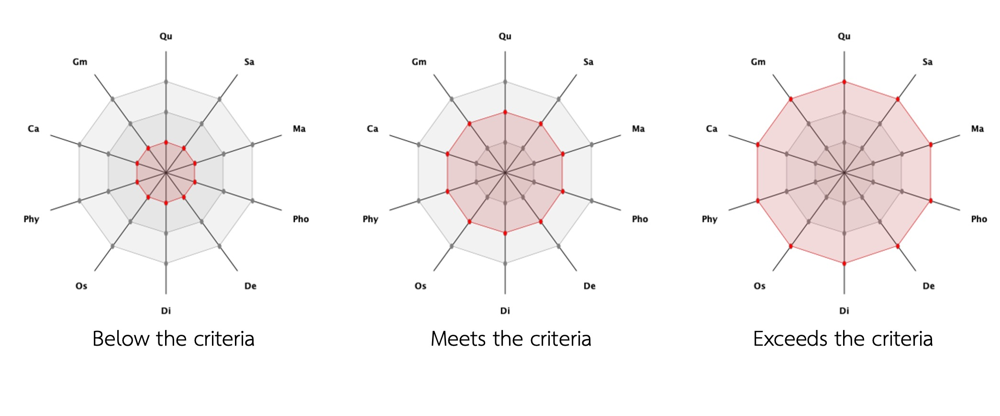

         In addition, the radar chart also shows the number of species that are as planned, not as planned, and the number of species that contain alien species.

         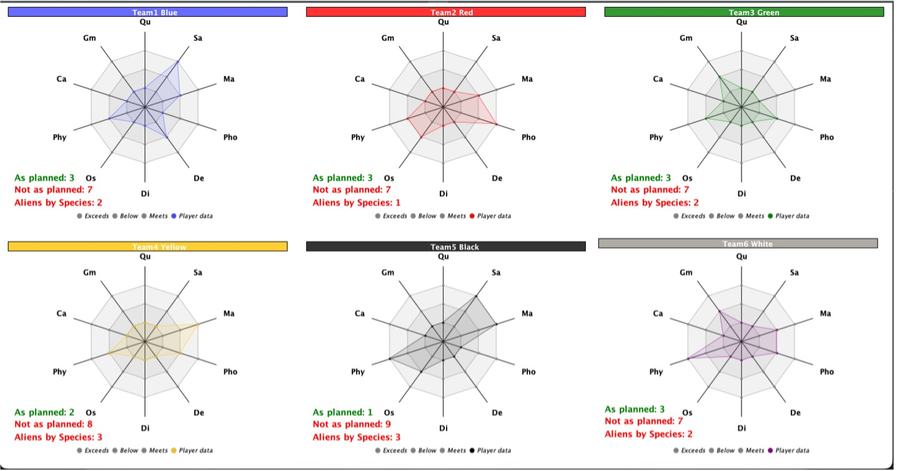

<!--
- **Scenario Controls**: [How to modify parameters]
--->

---

<!--
### Simulation Controls (GAMA Specific)

#### Running Simulations (GAMA)

1. Select scenario from webplatform
   
2. Click **"Run"** to start simulation

3. Monitor indicators in real-time
-->


<!--
#### Parameter Adjustment 
- **Forest trails**
   - `stop_time`
      - default: 180 (3 minutes)
      - affects: The duration that players need to explore the forest and collect seeds.

- **Forest Growth**
   - `map_size`
      - default: 100x100 square meters (1 hectare)
      - affects: The size of the area used in the forest restoration simulation.
   - `n_simulation`
      - default: 20 years
      - affects: Number of years to simulate forest growth.
   - `init_height`
      - default: 50 cm
      - affects: The initial height of the trees used for calculation in the logistic growth equation.
   - `init_RCD`
      - default: 2 cm
      - affects: The initial root collar diameter of the trees used for calculation in the logistic growth equation.
   - `num_of_oldtree`
      - default: 2859 trees
      - affects: The number of existing trees before forest restoration.


### Game Progression (Unity VR Specific)
--->

### Game Progression 

#### Stages

In Forest Trails, the activity is divided into six stages, each with a different level of difficulty. For example, the fruiting patterns of tree species vary across stages, as shown in Table X. In addition, in Stages 2, 4, and 6, alien tree species are included so that players can observe and be cautious about collecting alien species.

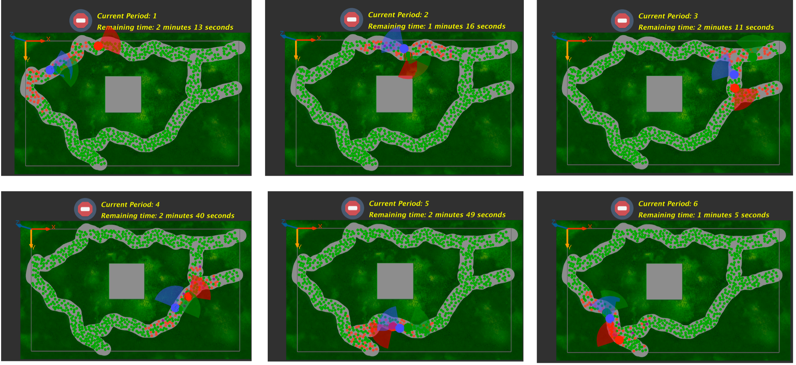

#### Progress tracking 

   Graph showing the number of seeds collected for each species and the total number of seeds.
ตามรูปที่ graph seed (link)

---

## Educational Features

### Learning Assessment

- In-activity checkpoints

   During the **Forest Trails** activity, GAMA displays real-time summaries of seed collection in two ways:

  1. Total Seeds Collected
   
      The figure shows the total number of seeds collected by each team, \
      updated in real time so that facilitators can monitor team performance during the activity.

  2. Seeds by Species
   
      The figure shows the number of seeds collected by each team, broken down by species.  \
      This view is also updated in real time and helps students see how many seeds come from different species
      (including native and alien species).

- Post-activity evaluation

   After the Forest Trails activity is completed, the number of seeds collected by each group is sent to the **Forest Growth** simulation and the **radar chart** module.

   - *Forest growth*
   This simulation visualizes 20 years of forest growth to show how the seeds collected by each group would develop into a forest over time.  
   Students can observe how their seed collection decisions influence forest structure and composition in the long term.

   - *Radar chart*
   The radar chart visualizes how well each group’s seed collection matches the predefined seed collection plan.  
    It shows:
    - The number of species collected **according to plan**  
    - The number of species collected **not according to plan**  
    - The number of species for which players collected **alien species**  

    This helps students reflect on their planning, decision-making, and the impact of collecting alien species.

- Progress reports for educators

   - Forest growth 
   The Forest Growth simulation uses the number of seeds collected by each team in the Forest Trails activity \
   to model how the forest will develop over the next 20 years.
   Its main purpose is to highlight the long-term outcomes of each team’s restoration efforts over a 20-year period.\
   Through this visualization, learners can observe that:
      - Different tree species grow at different rates and reach different sizes.
      - Planting alien species has noticeable impacts on overall forest structure and health.

      After viewing the simulation results, facilitators can invite learners to discuss:\
	   - The ecological impacts of collecting and planting alien species, and\
	   - How they might plan more sustainable forest restoration strategies in the future.


### Collaborative Features
<!--
- Multiplayer mode (if applicable)
- Shared scenarios
- Discussion forums
-->

- Group challenges
   - Competetion 
   During the forest trails activity, GAMA displays a real-time **Total Seeds** graph.  
   This allows all groups to see the total number of seeds collected by each team, 
   creating a sense of competition in each round as teams try to collect more seeds and better meet the defined criteria.


   - Collaboration 
   Within each team, students collaboratively design a seed collection strategy and decide which member will enter which trail zone.  
   Team members take turns using the VR headset, while the remaining members observe the map and seed collection graphs via the GAMA.   

   Teammates can:
    - Remind the current player to avoid alien species  
    - Suggest which species or zones to prioritize  
    - Help track the number of seeds collected for each species so that the team can meet the target seed collection plan  

### Educational Resources
<!--
- In-app glossary
-->

- Fact sheets 
   - Phenology fact sheets: Worksheets that indicate the fruiting periods of each species and support in-group decision-making about which member will enter which zone.
   - Seed Collection Plan: A worksheet that guides students to calculate the minimum and maximum number of seeds to collect for each species. Player can use it to design their seed collection strategy for each round before entering the forest trails.

- External links to resources (link)

- Teacher's guide availability

---

## Troubleshooting

### Common Issues and Solutions

#### VR-Specific Issues
**Problem**: One headset turned-off during a game

**Solution**:
- Turn it back on
- Reopen the game
- Auto-magically reconnecting

---

## Frequently Asked Questions

### General Questions

**Q: Can I use this offline?**

A: There is no offline version yet


**Q: How do I save my progress?**

A: Unable to save progress


**Q: Is this available in my language?**

A: Only in English

---

### Technical Questions

**Q: What VR headsets are supported?**

A: Meta Quest 3 only


**Q: Can I run this on a tablet/mobile device?**

A: No 

---

### Educational Questions

**Q: How long does each session take?**

A: **Forest Trails**: approximately 30 - 45 minutes\
   **Forest Growth**: approximately 10 - 20 minutes


**Q: Can teachers monitor student progress?**

A: Yes, teachers can monitor student progress through GAMA, 
   which displays real-time graphs of seed collection for each team.

---

### Bug Reporting

Please report bugs through:
1. GitHub issues page: [your repo]
2. [Else ?]

---

